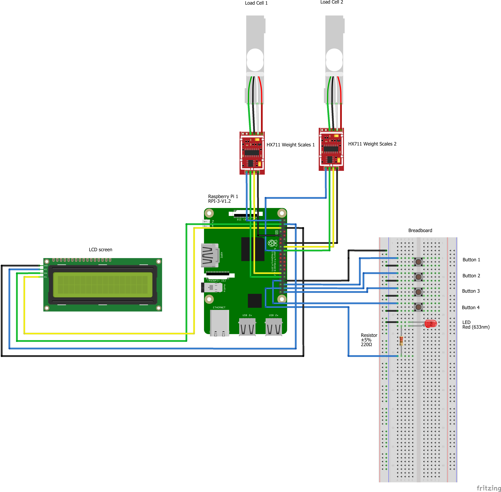
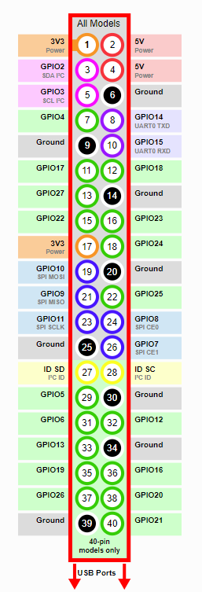

# How to Build Pet Resource Tracker Device

## Pre-Requisites

*   1x Raspberry Pi with GPIO
*   2x HX711 weight scales with Load Cells pre-connected
*   1x LCD screen
*   4x Buttons
*   1x LEDs
*   1x Breadboard
*   12x Female to Female Jumper Wires
*   6x Male to Male Jumper Wires
*   5x Male to Female Jumper Wires
*   12x Female to Female Jumper Wires
*   1x Resistor

Figure 1: Diagram of all device connections

Figure 2: Diagram of all Raspberry PI GPIO

*   Step 1: Disconnect Raspberry PI from power.
*   Step 2: Connect first HX711 weight scale to GPIO with 4x Female to Female jumper wires.

	* **_HX711 to GPIO_**
	* GRD - GRD(6)
	* DT  - GPIO5
	* SCK - GPIO6
	* VCC - 3V3(1)
*   Step 3: Connect second HX711 weight scale to GPIO with 4x Female to Female jumper wires.
	* **_HX711 to GPIO_**
	* GRD - GRD(14)
	* DT  - GPIO(23)
	* SCK - GPIO(24)
	* VCC - 3v3(17)
*   Step 4: Connect LCD screen to GPIO with 4x Female to Female jumper wires.
	* **_LCD to GPIO_**
	* GRD - GRD(6)
	* VCC - 5V(4)
	* SDA - GPIO(3)
	* SCL - GPIO(2)
*   Step 5: Attach 4x Buttons to Breadboard.
	* Left Pins - Column E
	* Right pins - Column F
*   Step 6: Connect button's bottom left row to breadboard's negative rail with 4x Male to Male jumper cables. 
	* A7  - Adjacent Negative Rail
	* A11 - Adjacent Negative Rail
	* A15 - Adjacent Negative Rail
	* A19 - Adjacent Negative Rail
*   Step 7: Connect button's top left row to GPIO with 4x Male to female jumper cables.
	* A5  - GPIO16
	* A9  - GPIO20 
	* A13 - GPIO21
	* A17 - GPIO13
*   Step 8: Attach 1x LED to breadboard.
	* Short pin - E22
	* Long pin - E23
*   Step 9: Connect LEDs Short pin row to breadboard's negative rail with 1x Male to Male jumper cables.
	* A22 - Adjacent Negative Rail
*   Step 10: Connect LEDs Long pin row to lower column on breadboard with 1x Resistor.
	* B23 - B31
	
* Step 11: Connect LEDs resistor row to GPIO.
	* A31 - GPIO(26)
*   Step 8: Connect breadboard negative rail to GPIO.
	* Top Negative Rail Pinhole - Ground(34)

## Next Steps...

Complete steps in 'How to verify device functionality'
