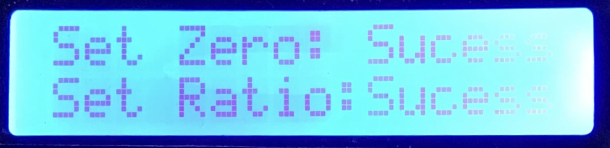

# How to use Pet Resource Tracker System

Keep track of your pet's food and water from anywhere. This document teaches you the following:

*   How to setup Tracking on your device
*   How to Access the Dashboard.

## Pre-Requisites
* Complete the _Pre-Requisites_ and _Steps 1-3_ in the [README](./README.md) document.

### How to setup Tracking on your device

*   Step 1: Remove any items from the food and water bowls. 
*   Step 2: Connect the Pet Resource Tracker Device to a power outlet.

*   Step 3: When scale measurements apear, verify that measurements equal zero. 

    *   If measurements are greater or less than zero, press the "Set Zero" button. 
         * 
*   Step 4: Fill the bowls with food and water. 

*   Step 5: When the bowls are full, press the "Set Max" button.
 
*   Step 6: Press "Enable Tracking"
 

"Enable Tracking' sends information about your pet's food and water to the Dashboard. The Dashboard is accessible from any device that can connect to the internet. 

### How to Access the dashboard

* Step 1: Open 'Google Sheets' on a mobile device or computer.
* Step 2: Sign in with the Google Account created in [How to setup Google Sheets API](/API%20Setup/how%20to%20setup%20google%20sheets%20api.md). 
* Step 3: Open the _Dashboard Spreadsheet_.
* Step 4: Open the _Dashboard_ tab.

The Dashboard provides Graphs that help you track how much food and water your pet has.
